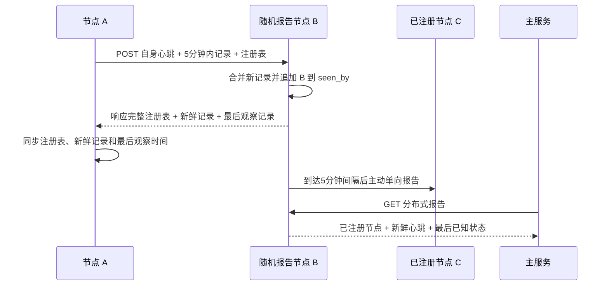

# 分布式心跳矩阵协议

## 目标

每台 Ubuntu 主机运行一个独立 Agent。任意 Agent 都保存已注册节点信息和最近心跳，主服务每个采样周期随机连接一个 Agent，即可读取该 Agent 视角下的节点活性与应用活性。

主服务仅读取报告，不承担节点间心跳来源，也不从 ccnode 对全部服务器逐台测试。

## 协议参数

| 参数 | 值 | 含义 |
|---|---:|---|
| 心跳新鲜期 | 300 秒 | 只转发不足 5 分钟的心跳 |
| 单目标报告间隔 | 300 秒 | 同一节点至少间隔 5 分钟再次报告 |
| 外部可见租约 | 300 秒 | 最近一次收到邻居签名确认的有效期 |
| 调度检查间隔 | 60 秒 | 检查哪些目标已达到报告时间 |
| 主服务采样间隔 | 60 秒 | 每轮只接受一个随机报告节点 |
| 离线判定窗口 | 660 秒 | 两次上报周期加一次调度余量 |
| 请求时间偏差 | 650 秒 | HMAC 请求允许的主机时钟偏差 |
| Agent 端口 | 9108/tcp | 节点报告和报告读取接口 |
| 样本保留时间 | 7 天 | 主服务保存的趋势样本 |

## 节点本地状态

Agent 使用本地 SQLite 保存以下状态：

- `registered_nodes`：所有已注册节点的 ID、名称、地址和端口。该表包含离线节点。
- `heartbeat_records`：每个节点最新一次有效心跳、应用状态和 `seen_by`。
- `outbound_status`：本机向每个目标最后一次尝试时间、成功确认时间、结果和延迟。
- `seen_reports`：最近收到的 `report_id`，用于幂等处理重复请求。

注册表、外部可见租约、转发新鲜度和离线判定分开管理。注册表和最后观察记录可以长期保留，超过 5 分钟的心跳停止传播；300 到 660 秒标记为同步延迟，超过 660 秒判定离线。

Agent 主进程和启动注册可能并发打开状态库。结构迁移使用 SQLite `BEGIN IMMEDIATE` 取得写锁，确保同一字段只迁移一次。

## 单向报告流程

### 启动注册

1. Agent 启动后，随机排列配置种子和本地注册表中的其他节点。
2. Agent 主动发送 `POST /v1/heartbeat`，失败时在同一轮继续尝试下一个随机节点，收到一个签名有效的成功响应后结束注册。
3. 请求携带本机心跳、全部已注册节点描述，以及本机保存的 5 分钟内心跳。
4. 接收节点在响应中返回完整注册表、本地新鲜心跳和每个节点的最后观察记录。
5. 发送节点保存成功确认时间并合并响应内容，因此只需要有一个可达种子即可加入矩阵。

### 周期报告

systemd 定时器每分钟执行一次目标选择。Agent 查询 `outbound_status`，在最近 300 秒内至少存在一个成功确认时，向从未报告过或最后尝试时间已经超过 300 秒的节点主动报告。

最近 300 秒没有任何成功确认时，节点进入立即注册状态，忽略单目标冷却时间并随机逐个尝试邻居，直到一个邻居确认接收。该规则把“至少一个外部节点持有本机新鲜心跳”作为在线节点的不变量。

每次请求包含：

- 发送节点刚生成的自身心跳。
- 本机保存且 `observed_at` 不足 300 秒的其他节点心跳。
- 本机完整注册表，用于传播新节点地址。

每个 Agent 都执行相同动作，通信方向始终由发送方主动发起。响应中的新鲜数据用于完成本次注册表同步；`latest_records` 保存每个节点最后已知状态。发送节点会合并时间戳更大的最后观察记录，即使该记录已经超过 300 秒，也不会把它重新放入 POST 的新鲜心跳集合。

## 防循环规则

每条心跳记录包含 `seen_by`，记录该心跳已经经过的节点 ID。

- 节点接收心跳时把自身 ID 加入 `seen_by`。
- 节点准备向目标发送时，过滤掉 `seen_by` 已包含目标 ID 的转发记录；本机新生成的自身心跳始终发送。
- 节点自己的新心跳包含自身 ID 和最近 300 秒内成功确认接收的邻居 ID。
- 相同节点、相同 `observed_at` 的记录合并 `seen_by` 集合。
- 相同 `report_id` 只合并一次，重复请求返回当前状态。

目标不可达会作为活性结果写入 `outbound_status`。仍有有效可见性租约时按单目标间隔重试；所有租约失效时，下一个每分钟调度立即进入随机回退注册。

该规则允许每个节点持续上报自己的新心跳，同时阻止同一条转发心跳再次回到已经经过的节点。

## 主服务采样

主服务每 60 秒随机排列已启用心跳的节点，并按顺序尝试读取 `GET /v1/report`。第一个成功返回且签名有效的 Agent 成为本轮报告源，其余节点在本轮不再读取。

主服务从报告源返回的注册表、新鲜记录和最后已知记录生成每个节点的样本：

- 多节点环境中，`peer_visible=0` 的 self-only 心跳网络活性为 0，并显示“未被邻居确认”。
- 至少一个外部节点确认且心跳不足 300 秒时，网络活性为 100。
- 节点心跳达到 300 秒且不足 660 秒时，网络活性为 70，并显示同步延迟。
- 节点心跳达到 660 秒时，网络活性为 0，并判定离线。
- `app_score` 由节点本机检查配置中的自定义 systemd 服务计算，延迟窗口保留最后状态。
- `peer_visible` 取自心跳的 `seen_by`，用于显示传播覆盖。
- 每个样本记录报告源节点，便于排查数据视角。

报告源不可用时，主服务自动尝试下一台节点。所有候选节点均不可用时，本轮节点活性记录为 0，并保存失败原因。

## 中断发现时序

设中断节点最后一次有效心跳时间为 `t_last`：

1. 已持有该记录的节点在 `t_last + 300 秒`进入同步延迟状态。
2. `latest_records` 在响应中继续同步最后观察时间。当前所有节点均可连接 2 或 7 号枢纽时，仍在线节点会在一个 300 秒单目标报告周期内取得该时间戳。
3. 所有取得该记录的节点在 `t_last + 660 秒`形成离线结论。
4. 主服务最多再等待一个 60 秒采样周期，因此页面最迟在 `t_last + 720 秒`反映离线。

网络完全分区时不存在跨分区的一致发现时限。每个连通分量只能依据本分量已经同步的最后观察时间形成结论。

部署脚本每次覆盖协议文件后都会重启 Agent 和定时器，并立即执行一次报告，确保运行进程加载当前协议。

## 应用活性

部署脚本从服务器最近一次环境检测结果中提取 `category=custom` 的 systemd 服务。Agent 本机运行 `systemctl is-active`，按活动服务数量计算 `app_score`。

没有可监控的自定义服务时，`app_score` 返回空值，界面显示“无数据”，避免把未配置监控误报为 100 分。
环境检测后新增或删除应用服务时，需要重新运行对应节点的部署命令，使 Agent 配置同步最新服务清单。

## 安全

- 所有 POST 和 GET 请求使用 `OPS_MESH_SECRET` 生成 HMAC-SHA256 签名。
- 响应同样带有 HMAC 签名，主服务和 Agent 都验证响应节点 ID、时间戳和正文签名。
- 新节点只要持有共享密钥即可动态注册。
- `report_id` 提供请求幂等，时间戳限制重放窗口。
- 配置文件权限为 `0640 root:serverdesk-heartbeat`。
- Agent 使用独立系统用户运行，systemd 启用 `NoNewPrivileges`、`ProtectSystem=strict` 和 `ProtectHome=true`。
- 部署参数 `--configure-firewall` 只为完整注册表中的节点 IP 添加 UFW 来源白名单，不创建面向任意来源的 9108 规则，也不自动启用 UFW。
- 云厂商安全组需要独立配置相同的节点 IP 白名单；主机 UFW 规则无法替代云侧入站策略。

## 验收

1. 任意节点的报告包含全部已注册节点描述。
2. POST 转发记录均不足 300 秒，GET 报告保留每个节点最后已知状态。
3. 启动注册的首个随机目标失败时，同一轮继续尝试直到收到一个成功确认。
4. 最近 300 秒没有成功确认时，节点立即进入回退注册。
5. 最后观察记录可以跨节点合并，且不会进入 POST 新鲜转发集合。
6. 转发记录的 `seen_by` 不包含重复节点。
7. 向某个目标生成报告时，不包含该目标已经见过的转发记录，自身新心跳除外。
8. 多节点环境中的 self-only 心跳显示为“未被邻居确认”，网络活性为 0。
9. 心跳达到 300 秒后显示同步延迟，停止 Agent 达到 660 秒后显示离线。
10. 停止被监控的应用服务后，下一个有效心跳中的 `app_score` 降低。
11. 防火墙部署命令只包含已登记节点 IP，不包含面向任意来源的 `9108/tcp` 放行规则。
