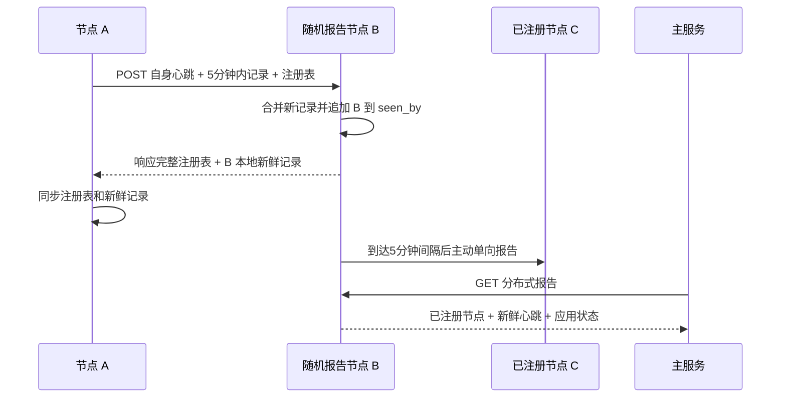

# 分布式心跳矩阵协议

## 目标

每台 Ubuntu 主机运行一个独立 Agent。任意 Agent 都保存已注册节点信息和最近心跳，主服务每个采样周期随机连接一个 Agent，即可读取该 Agent 视角下的节点活性与应用活性。

主服务仅读取报告，不承担节点间心跳来源，也不从 ccnode 对全部服务器逐台测试。

## 协议参数

| 参数 | 值 | 含义 |
|---|---:|---|
| 心跳新鲜期 | 300 秒 | 只转发不足 5 分钟的心跳 |
| 单目标报告间隔 | 300 秒 | 同一节点至少间隔 5 分钟再次报告 |
| 调度检查间隔 | 60 秒 | 检查哪些目标已达到报告时间 |
| 请求时间偏差 | 650 秒 | HMAC 请求允许的主机时钟偏差 |
| Agent 端口 | 9108/tcp | 节点报告和报告读取接口 |
| 样本保留时间 | 7 天 | 主服务保存的趋势样本 |

## 节点本地状态

Agent 使用本地 SQLite 保存以下状态：

- `registered_nodes`：所有已注册节点的 ID、名称、地址和端口。该表包含离线节点。
- `heartbeat_records`：每个节点最新一次有效心跳、应用状态和 `seen_by`。
- `outbound_status`：本机向每个目标最后一次尝试时间、结果和延迟。
- `seen_reports`：最近收到的 `report_id`，用于幂等处理重复请求。

注册表信息和心跳新鲜度分开管理。注册表可以长期保留，超过 5 分钟的心跳不会继续传播，也不会被判定为在线。

## 单向报告流程

### 启动注册

1. Agent 启动后，从配置种子和本地注册表中随机选择一个节点。
2. Agent 主动发送一次 `POST /v1/heartbeat`。
3. 请求携带本机心跳、全部已注册节点描述，以及本机保存的 5 分钟内心跳。
4. 接收节点在响应中返回完整注册表和本地新鲜心跳。
5. 发送节点合并响应内容，因此只需要知道一个可用种子即可加入矩阵。

### 周期报告

systemd 定时器每分钟执行一次目标选择。Agent 查询 `outbound_status`，向从未报告过或最后尝试时间已经超过 300 秒的节点主动报告。

每次请求包含：

- 发送节点刚生成的自身心跳。
- 本机保存且 `observed_at` 不足 300 秒的其他节点心跳。
- 本机完整注册表，用于传播新节点地址。

每个 Agent 都执行相同动作，通信方向始终由发送方主动发起。响应中的数据只用于完成本次注册表同步。

## 防循环规则

每条心跳记录包含 `seen_by`，记录该心跳已经经过的节点 ID。

- 节点接收心跳时把自身 ID 加入 `seen_by`。
- 节点准备向目标发送时，过滤掉 `seen_by` 已包含目标 ID 的记录。
- 节点自己的新心跳从 `seen_by=[self]` 开始。
- 相同节点、相同 `observed_at` 的记录合并 `seen_by` 集合。
目标不可达会作为活性结果写入 `outbound_status`，定时任务本身保持成功状态并在下一个到期窗口继续尝试。

- 相同 `report_id` 只合并一次，重复请求返回当前状态。

该规则允许每个节点持续上报自己的新心跳，同时阻止同一条转发心跳再次回到已经经过的节点。

## 主服务采样

主服务每 300 秒随机排列已启用心跳的节点，并按顺序尝试读取 `GET /v1/report`。第一个成功返回且签名有效的 Agent 成为本轮报告源，其余节点不再由主服务直接连接。

主服务从报告源返回的注册表和新鲜记录生成每个节点的样本：

- 节点心跳不足 300 秒时，网络活性为 100。
- 节点缺少新鲜心跳时，网络活性为 0。
- `app_score` 由节点本机检查配置中的自定义 systemd 服务计算。
- `peer_visible` 取自心跳的 `seen_by`，用于显示传播覆盖。
- 每个样本记录报告源节点，便于排查数据视角。

报告源不可用时，主服务自动尝试下一台节点。所有候选节点均不可用时，本轮节点活性记录为 0，并保存失败原因。

## 应用活性

部署脚本从服务器最近一次环境检测结果中提取 `category=custom` 的 systemd 服务。Agent 本机运行 `systemctl is-active`，按活动服务数量计算 `app_score`。

没有可监控的自定义服务时，`app_score` 返回空值，界面显示“无数据”，避免把未配置监控误报为 100 分。
环境检测后新增或删除应用服务时，需要重新运行对应节点的部署命令，使 Agent 配置同步最新服务清单。

## 安全

- 所有 POST 和 GET 请求使用 `OPS_MESH_SECRET` 生成 HMAC-SHA256 签名。
- 响应同样带有 HMAC 签名，主服务和 Agent 都验证响应节点 ID、时间戳和正文签名。
- 新节点只要持有共享密钥即可动态注册。
- `report_id` 提供请求幂等，时间戳限制重放窗口。
- 配置文件权限为 `0640 root:serverdesk-heartbeat`。
- Agent 使用独立系统用户运行，systemd 启用 `NoNewPrivileges`、`ProtectSystem=strict` 和 `ProtectHome=true`。

## 验收

1. 任意节点的报告包含全部已注册节点描述。
2. 在线节点的心跳记录均不足 300 秒。
3. 转发记录的 `seen_by` 不包含重复节点。
4. 向某个目标生成报告时，不包含该目标已经见过的转发记录。
5. 主服务一个采样周期最多成功读取一个报告节点。
6. 停止任一 Agent 超过 5 分钟后，该节点显示心跳过期。
7. 停止被监控的应用服务后，下一个有效心跳中的 `app_score` 降低。
